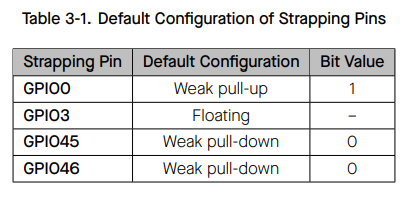

This document explains how to properly understand and use GPIO pins on the  
**Heltec WiFi LoRa 32 V3 (ESP32-S3)** development board, with a focus on hardware safety and system stability.

It is important to note that:

> The pinout diagram only shows what *functions a chip pin supports*.  
> Whether a GPIO pin can be safely used in practice is determined by the [**board schematic**](https://resource.heltec.cn/download/WiFi_LoRa_32_V3/HTIT-WB32LA(F)_V3.1_Schematic_Diagram.pdf) and the [**ESP32-S3 Datasheet**](https://documentation.espressif.com/esp32-s3_datasheet_en.pdf).

---

## General Selection Principles

For beginner users, the following rules should always be followed:

- Avoid boot strapping pins
- Avoid Flash / SubSPI / PSRAM related pins
- Avoid pins already used by on-board peripherals
- Prefer unused general-purpose GPIOs

Following these principles ensures stable boot behavior, predictable operation, and reliable peripheral interaction.

## Practical GPIO Classification on Heltec V3

From the perspective of **safe external hardware connection**, GPIO pins on Heltec WiFi LoRa 32 V3 can be categorized into four practical groups.

---

## 1. Strapping Pins

### Description

Boot strapping pins are sampled during **power-on or reset** to determine the chip startup mode.  
These pins are extremely sensitive during the boot phase.

Although some of them may function as normal GPIOs after boot, external circuitry can easily affect their logic level at reset, resulting in boot failures or incorrect boot modes.

### Typical Phenomenon

- Device fails to boot normally
- USB serial port is not detected
- Manual bootloader entry is required
- Unstable or inconsistent startup behavior

For example, connecting external circuitry to **GPIO46** may prevent normal boot and require manual entry into bootloader mode.

### ESP32-S3 Strapping Pins (per official documentation)

The following GPIOs are not recommended for external connections.

These definitions originate from the [**ESP32-S3 Technical Reference Manual**](https://documentation.espressif.com/esp32-s3_datasheet_en.pdf).

---

## 2. General-Purpose / Multiplexed GPIOs (ADC / Touch)

### About ADC_CHx and TOUCHx Labels

ADC and Touch labels indicate **internal peripheral multiplexing capabilities** of the ESP32-S3.  
They do **not** indicate that the pin is occupied by on-board hardware.

When ADC or Touch functions are not enabled in software, these pins behave exactly like standard GPIOs.

### Supported Applications

- Digital input and output
- I²C, UART, SPI (via ESP32 I/O Matrix)

### GPIOs Available for External Use on Heltec WiFi LoRa 32 V3

According to the Heltec V3 schematic, the following GPIOs are not occupied by on-board peripherals and may be safely used:

- GPIO1 ADC1_CH0 TOUCH1
- GPIO2 ADC1_CH1 TOUCH2
- GPIO4 ADC1_CH3 TOUCH4
- GPIO5 ADC1_CH4 TOUCH5
- GPIO6 ADC1_CH5 TOUCH6
- GPIO7 ADC1_CH6 TOUCH7
- GPIO19 ADC2_CH9 U1RST CLK_OUT2 USB_D-
- GPIO20 ADC2_CH9 U1CTS CLK_OUT2 USB_D+

GPIO19 and GPIO20 have multiple alternate functions listed in the datasheet, but are not used by default on the Heltec V3 board configuration.

---

## 3. Internally Reserved Pins (Flash / SubSPI / On-board Devices)

These pins are connected to internal high-speed buses or critical on-board hardware.  
They are essential for firmware storage, execution, or board-level functions.

External connection or reuse of these pins may cause:

- Boot failure
- Random crashes
- Firmware download issues
- Unreliable system behavior

### Heltec WiFi LoRa 32 V3 Reserved Pins

- GPIO33–GPIO38  
  Used for SPI Flash / SubSPI communication  
  Must not be used as general GPIO

- GPIO26  
  Used internally as a SubSPI chip-select signal  
  Not recommended for external use

- GPIO21  
  Connected to the on-board OLED reset line  
  Not available for external peripherals

- GPIO43, GPIO44  
  Used for USB serial download functionality  
  Should not be repurposed

---

## 4. Optional System Interface Pins (JTAG)

The following GPIOs are assigned to the ESP32-S3 JTAG interface by default:

- GPIO39 (MTCK)
- GPIO40 (MTDO)
- GPIO41 (MTDI)
- GPIO42 (MTMS)

These pins are not involved in boot configuration or normal runtime operation.
If JTAG functionality is disabled in software, they can be reconfigured as general-purpose GPIOs using the I/O Matrix.
For beginner users or development boards used for debugging, these pins are not recommended.

## GPIO47 && GPIO48

GPIO47 and GPIO48 are general-purpose GPIOs on the ESP32-S3.
They are not used for boot configuration or internal system interfaces.

On the Heltec WiFi LoRa 32 V3, neither pin is connected to any on-board peripheral
and both are available for external use after boot.

## Recommended GPIOs for External Hardware (Beginner-Friendly)

For Heltec WiFi LoRa 32 V3, the following GPIOs are recommended for external peripherals:

**`GPIO1` `GPIO2` `GPIO4` `GPIO5` `GPIO6` `GPIO7` `GPIO19` `GPIO20` `GPIO47` `GPIO48`**

