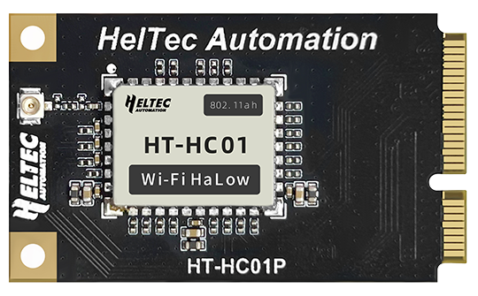

import styles from '@site/src/css/styles.module.css';

  

HT-HC01P is a Wi-Fi HaLow module with a mini PCIe interface, operating in the 902–928 MHz band. It supports data rates up to 32.5 Mbps and provides a transmission range of 1–2 km. Compliant with IEEE 802.11ah, it is optimized for battery-powered devices by enabling longer sleep and idle periods, significantly reducing power consumption and extending battery life.

{

  <a href="https://heltec.org/project/ht-hc01p/" className={styles.btnLink1}>
    Product Page
  </a>

}

## Product characteristics
- Up to 1 km+ long-range Sub-1 GHz communication (902–928 MHz).
- 1–8 MHz channel bandwidth with max 32.5 Mbps data rate.
- Low-power hibernate mode with internal/external wake-up.
- 1 dBm max output power.
- IEEE 802.11ah (Wi-Fi HaLow) certified, with OFDM and strong security.
                             
## Important parameters
| [parameters](https://resource.heltec.cn/download/HT-HC01P/Datasheet/HT-HC01P_Rev.1.0.0.pdf)         | HT-HC01P        |
|--------------------|----------------------------|
|MCU     |	   		MM6108IQ             |
|Power Supply  |     	3.3V            |
|HaLow Standard     |   	IEEE 802.11ah           |
|Band Width       | 		1/2/4/8MHz       |
|Data Rate          |  	32.5 Mbps @ 8 MHz|
|Dimensions       |   	50.95*30.00*3.75mm |

## Important Resources

- [Datasheet](https://resource.heltec.cn/download/HT-HC01P/Datasheet/HT-HC01P_Rev.1.0.0.pdf)
- [Schematic diagram](https://resource.heltec.cn/download/HT-HR01/Schematic_diagram/HT-HR01_V1_0.PDF)
- [Related Resources ](https://resource.heltec.cn/download/HT-HC01P)
- [SDK](https://github.com/MorseMicro)

