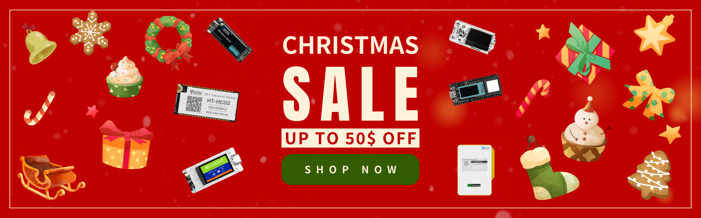
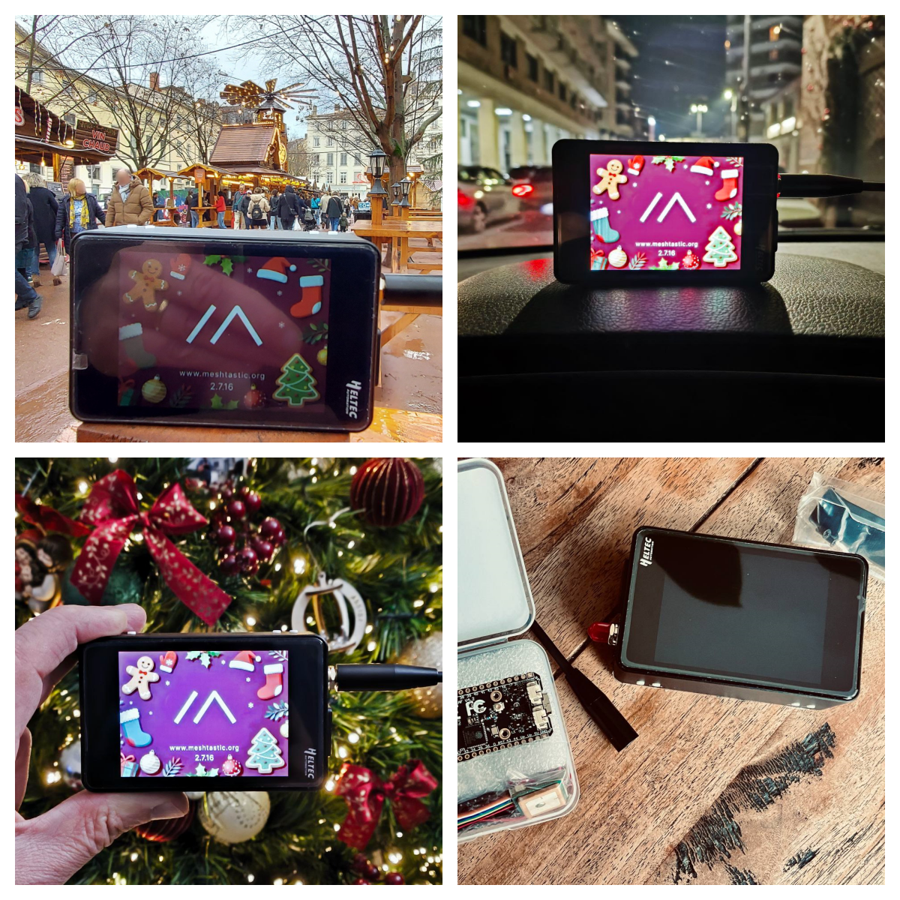
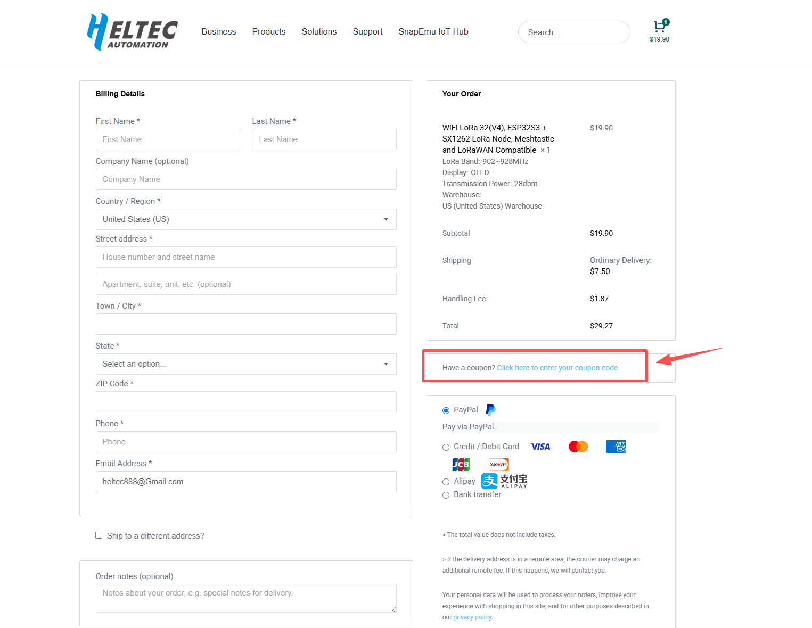

December 23, 2025​ – As Christmas bells ring in and the New Year approaches, Heltec Automation, a globally leading provider of IoT and open-source hardware solutions, today announced the launch of its annual "Christmas Gifts, New Year Ideas" dual-festival promotion. The campaign will warmly begin on **December 24, 2025, and run through January 5, 2026**. Designed as a special seasonal gift for the global developer and maker community, this promotion features carefully structured tiered discounts, aiming to help every innovator equip themselves with the ideal "tools for creation" during this festive season and step confidently into their 2026 projects.

<!-- truncate -->

### The Core Offer: A Customizable "Developer's Gift List"
For this dual-festival event, Heltec has prepared four clear "gift options," ensuring developers at every stage can find their perfect holiday surprise:  Gift Tier 1 :​ Use promo code **KBM58Z33**​ to get 5$ off on order sover **50**. Gift Tier 2 :​ Use promo code **3XYJMFKS**​ to get 20$ off on order sover **150**. Gift Tier 3 :​ Use promo code **2HFACDPE**​ to get 50$ off on order sover **350**. Gift Tier 4 :​ Use promo code **758DFBCJ**​ to get 80$ ff on order sover **600**.

"Christmas is a time for sharing gifts and warmth, while the New Year symbolizes planning and new beginnings," stated the Marketing Director at Heltec. "We understand that for developers, the most practical gift might be a set of reliable tools that unlock their creativity. Therefore, this year, we chose this direct and flexible way to show our support for our community partners, hoping this 'tool list' can serve as a solid starting point for realizing their first project ideas of 2026."

### Beyond Discounts: A Commitment to Long-Term Community Partnership
This campaign is more than a festive offer; it reflects Heltec's long-standing commitment to "walking with innovators." During and beyond the promotion period, Heltec's rich open-source project library, detailed technical documentation, and vibrant developer community will continue to provide support for all users, ensuring this "gift" translates into real creative value.

### Campaign Information

Campaign Theme:​ Christmas Gifts, New Year Ideas Campaign Period:​ **00:00, December 24, 2025, to 23:59, January 5, 2026** (GMT+8) How to Participate:​ Visit the official Heltec store and apply the relevant promo code at checkout.