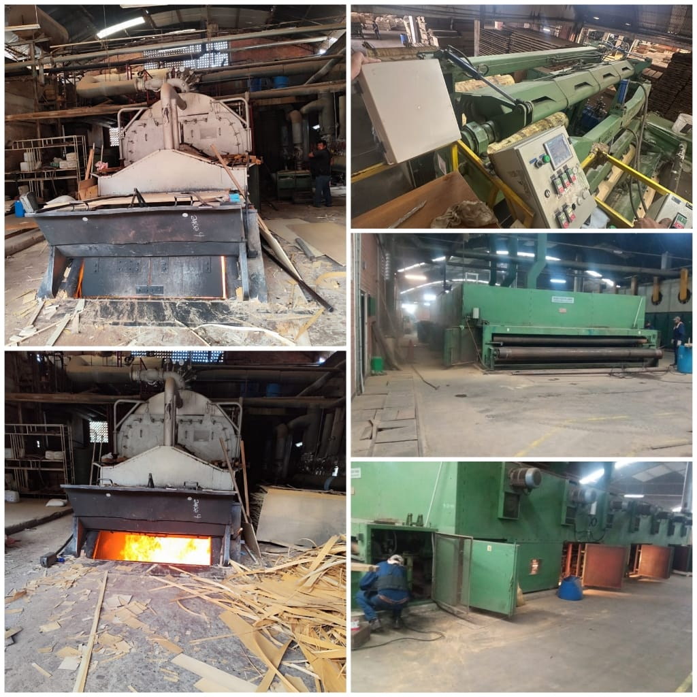
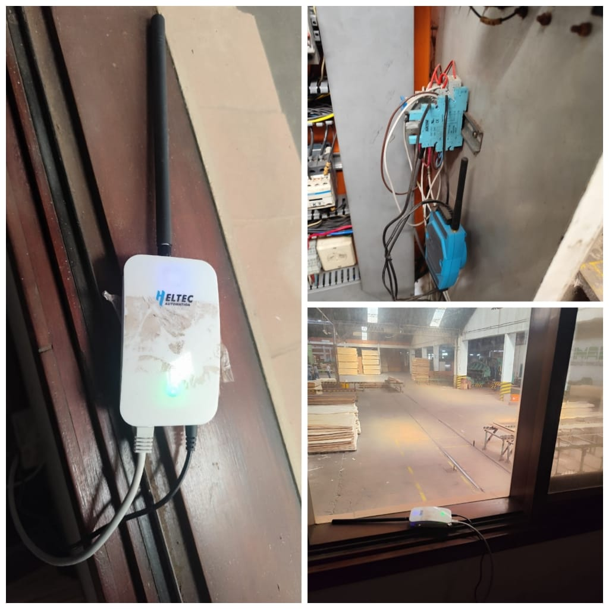
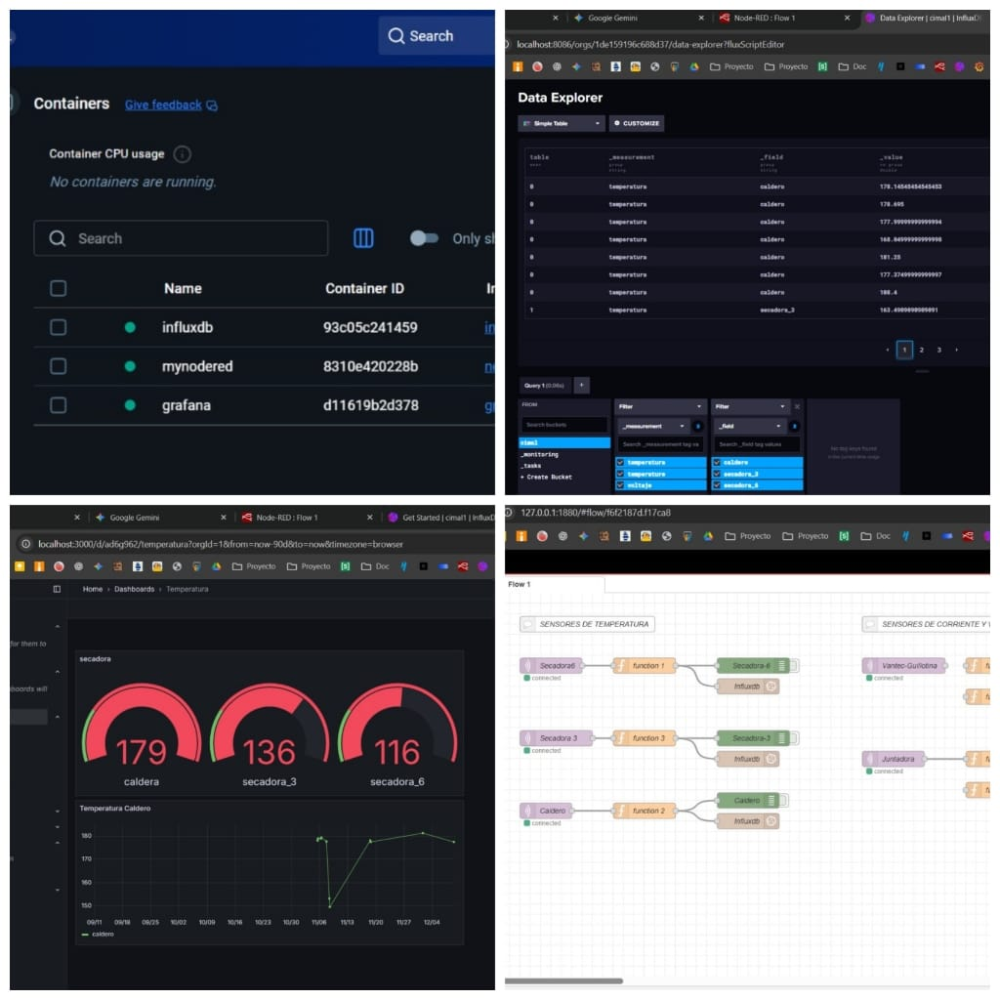

## 🌲 SmartLumber: Industrial LoRaWAN Monitoring & Predictive Digital Twin

<!-- truncate -->

This project presents a comprehensive Industry 4.0 solution applied to a real sawmill. We have deployed a LoRaWAN-based monitoring infrastructure using the Heltec HT-M7603 Gateway to overcome in-plant connectivity challenges.

Additionally, faced with a lack of historical breakdown data, we developed an innovative Predictive Maintenance (PdM) approach by creating an "Operational Digital Twin" in Python. This allowed us to train an LSTM neural network capable of predicting critical mechanical failures 7 days in advance in a simulated environment, validating the architecture before the first real failure occurs.

### 📖 Project Story
In a lumber processing plant 🏭, the environment is hostile to conventional technology. There is sawdust in the air, electromagnetic noise generated by high-power motors, and distances exceeding 500 meters between industrial halls. Traditional solutions like Wi-Fi or direct Ethernet cabling to every sensor are technically or economically unfeasible.

Currently, maintenance is purely reactive: machines are repaired only when they break, generating enormous costs and production downtime. Our mission was to digitize critical assets like the Boiler, Dryers, and Lathes to prevent these stoppages. However, we faced two major problems:

- 📡 **Connectivity:** We needed a technology capable of penetrating metal and concrete walls while covering large areas.

- 💾 **The Data Paradox:** Fortunately, the plant hasn't had recent catastrophic failures. This is good for business, but bad for the data engineer, as we lacked a history of "failures" to train an Artificial Intelligence.

**The Solution:** Choose **Heltec hardware** to definitively solve the connectivity problem and develop a software **"Digital Twin"** to simulate motor physics and learn from failures that haven't happened yet.

### 🛠️ Preparation
To replicate this IIoT (Industrial IoT) architecture, we used the following components:

⚙️ Hardware
- Gateway: 1x Heltec HT-M7603 Indoor LoRaWAN (Frequency US915). Selected for its stability and processing capacity.

- Industrial LoRaWAN Sensors: Including Milesight MT500-PT (Vibration/Temperature) and Dragino LT-22222-L (I/O Controller).

- Support Sensors: HEYUAN OT-L2S-F1 and DZS310.

💻 Software (Tech Stack)
- 🐳 Docker & Docker Compose: For service orchestration on a local server.

- 🔴 Node-RED: For flow logic and MQTT connection.

- 🗄️ InfluxDB: As a high-performance time-series database.

- 📊 Grafana: For telemetry visualization.

- 🐍 Python (TensorFlow/Keras): For synthetic data generation and LSTM model training.

### ⚙️ Implementation Process
The implementation was divided into two critical phases: the physical connectivity infrastructure and the artificial intelligence logic.

1. **Connectivity Architecture (The Heltec Role)** 📡
The network topology is a star configuration centralized by the Heltec HT-M7603. We installed this Gateway in the control room and connected it to the internet via Ethernet to guarantee the lowest latency and highest stability possible in the noisy industrial environment. The Gateway collects data from sensors located in the Boiler, Dryers 3 and 6, the Veneer Lathe, and the Guillotine, demonstrating its capability to penetrate the plant's infrastructure.

2. **Data Pipeline** 🔄
The flow follows the Industry 4.0 standard:

-  Sensors send encrypted data via LoRa.

- The Heltec Gateway receives the packets and forwards them to The Things Network (TTN).

- Locally, we use Node-RED to subscribe to the TTN MQTT topic, decode the payloads, and store them in InfluxDB.

- We use Docker to containerize the entire solution, allowing this system to be replicable on any server in a matter of minutes.

🔄 **Data Flow and Backend Deployment**

To replicate our IoT server, we used Docker to containerize the entire solution. This allows the whole system (Grafana, InfluxDB, and Node-RED) to be installed with just a few commands on any Linux server or Raspberry Pi.

🐧 **Step A: Dependency Installation** First, we update the system and install Docker and Git via the terminal:

Bash

sudo apt update && sudo apt upgrade -y

sudo apt install docker.io docker-compose git -y

📦 **Step B: Container Download and Configuration** To facilitate replication, we use a docker-compose.yml file that automatically downloads and configures the necessary images. The code we used is as follows:

YAML

version: '3'
services:
  nodered:
    image: nodered/node-red
    ports:
      - "1880:1880"
    volumes:
      - node_red_data:/data
    restart: always
  influxdb:
    image: influxdb:1.8
    ports:
      - "8086:8086"
    volumes:
      - influxdb_data:/var/lib/influxdb
    restart: always
  grafana:
    image: grafana/grafana
    ports:
      - "3000:3000"
    volumes:
      - grafana_data:/var/lib/grafana
    restart: always

volumes:
  node_red_data:
  influxdb_data:
  grafana_data:

🚀 **Step C: Server Execution**
Once the previous file is created, we execute the following command to download the images and start the server:

Bash

sudo docker-compose up -d

3. **The Truth of the Predictive Model (Digital Twin)** 🧠
Here we applied a Research and Development (R&D) approach. Since we couldn't wait for a real machine to explode to gather data, we opted for rigorous technical validation via an Operational Digital Twin (DTO).

We created a Python script that simulates the physics of an industrial motor subjected to specific degradation patterns, such as:

🔥 **"Coolant leak"** (gradual temperature increase).

📉 **"Ring wear"** (increase in vibration and pressure).

Using this data, we trained a **Recurrent Neural Network (LSTM)**. We chose LSTM for its ability to remember long time sequences. The model analyzes 72-hour windows of operational data to classify if the equipment is "Healthy" or in a "Pre-failure" state (imminent within 7 days).

### Análisis de Datos y Predicción
Para ver el detalle técnico de cómo procesamos los datos del aserradero y el algoritmo predictivo, puedes consultar nuestro notebook interactivo:

📈 **Validation Results:**

**AUC-ROC: 0.9925** – The model discriminates almost perfectly between normal operation and the failure pattern.

**Recall: 1.0000** – Using an optimized threshold, the model detected 100% of the simulated failures.

**F1-Score: 0.7382** – A solid balance between precision and sensitivity.

### 🏆 Finished Project Showcase / Summary
The project has been a technical success. We have achieved continuous digital surveillance in the sawmill, and the Heltec Gateway has demonstrated 99.9% stability.

⚠️ **Engineering Note:**

We are honest engineers: although the LSTM model is mathematically robust, it was validated in a "Digital Twin" environment. This implies a known limitation called "Domain Shift." Real data will have electromagnetic noise and mechanical irregularities that the idealized simulation does not 100% contemplate.

🚀 **Next Steps:**

The next step in our roadmap is to leverage the installed Heltec infrastructure to collect real data over the coming 3 months. With that real dataset, we will apply "Transfer Learning" techniques to recalibrate our base LSTM model, closing the gap between the simulation and physical reality.

Heltec technology has been the fundamental enabler in transforming an analog sawmill into a connected industry, laying solid foundations for Industrial Artificial Intelligence.
