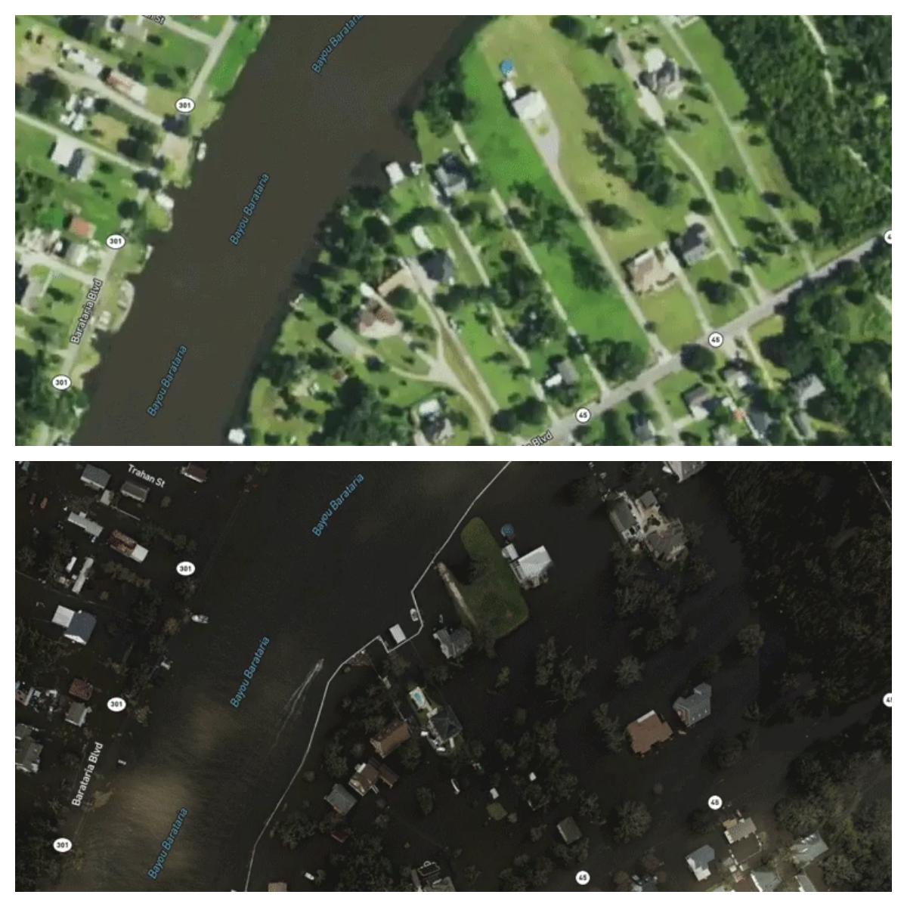
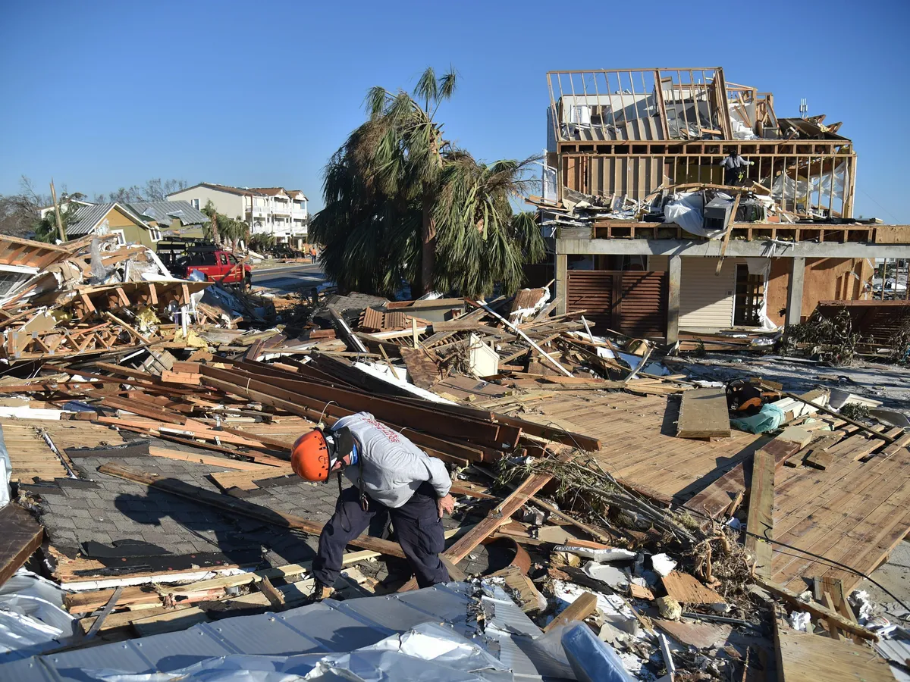
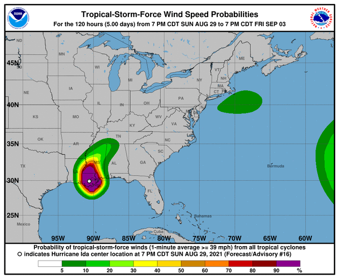
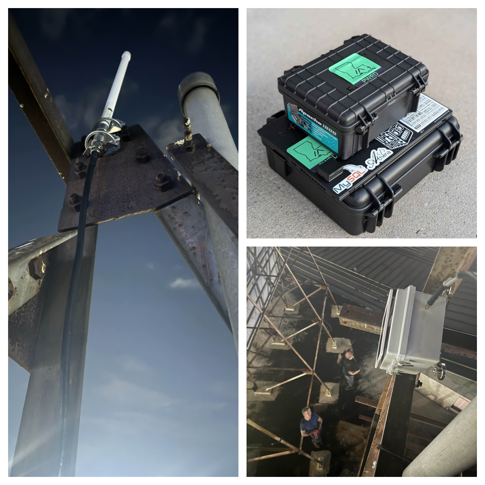
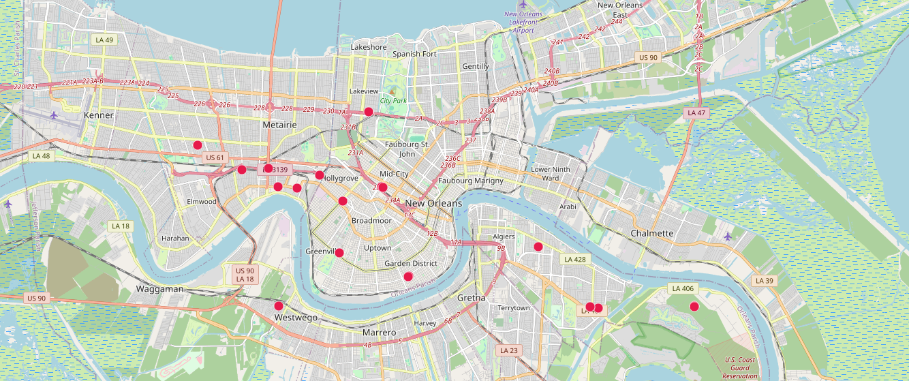
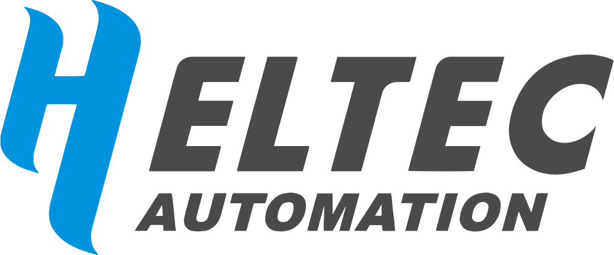

Recently, Heltec received a special letter. The sender was Lenley Ngo from Louisiana, USA, a key maintainer of the [**"Louisiana Mesh Community."**](https://louisianamesh.org/) The letter described how hurricanes repeatedly destroyed cellular networks, separating families and hindering rescue efforts. "Our only means of communication is walkie-talkies, and cellular network repairs will take weeks," Lenley wrote. The letter didn't make many requests, but rather conveyed a heavy responsibility and a clear plan: to use decentralized mesh networks to leave a lifeline for the most dangerous times. Today, Heltec solemnly announces: **we will support the Louisiana Mesh Community, becoming the technical backbone for these "guardians in the storm."**

<!-- truncate -->

### "Information silos" in disasters: a pressing real-world problem that needs to be solved.

Louisiana's coastline is beautiful yet fragile. Residents face the threat of hurricanes every year, and the most devastating blow is often the "communication silence" that follows.

**The "Golden Hour" After a Disaster**

After a major hurricane, critical cellular infrastructure typically collapses within an hour.This is not an exaggeration. Real hurricanes like [**Helene**](https://wirelessestimator.com/articles/2024/unprecedented-outage-no-hurricane-has-knocked-out-more-cell-sites-than-category-4-helene/?utm_source=chatgpt.com) (and historical hurricanes like Hurricane Maria and Hurricane Michael) severely damage cellular communication networks shortly after landfall, causing widespread "internet outages/communication disruptions." This poses a significant challenge to disaster relief, personnel communication, assistance requests, and the dissemination of information.

**The cost in lives**

In [**Hurricane Katrina (2005)**]( (https://www.cambridge.org/core/journals/disaster-medicine-and-public-health-preparedness/article/hurricane-katrina-deaths-louisiana-2005/8A4BA6D478C4EB4C3308D7DD48DEB9AB?utm_source=chatgpt.com)), approximately **971–986 people** in Louisiana alone were believed to have died “storm-related.” 
Furthermore, a [**2023 state-level report**]((https://gov.louisiana.gov/assets/statewide-resilience-report-final.pdf?utm_source=chatgpt.com)) indicated that from 1980 to 2023, Louisiana's total number of deaths due to all "billion-dollar weather and climate disasters" was **8,655**.

The Louisiana Mesh community was born from this painful experience. Lenley and his partners decided that they couldn't always rely on large carriers to fix their networks. They began to build a more decentralized and resilient communication system on their own.

### The blueprint for "Community Guardians": Connecting every concern with our devices.

This volunteer-driven community has made solid progress. Using LoRa devices from brands like Heltec and flashing them with Meshtastic firmware, they have successfully built multiple relay nodes in locations such as New Orleans, establishing a nascent mesh network. Their plans are specific and clear:

1.Deploy repeaters at fire stations: They are collaborating with local fire stations to install repeaters in ruggedized facilities to expand network coverage. 2.Establish satellite uplinks: Connecting to Starlink satellite internet through key network nodes ensures continued communication even during local network outages. 3.Develop SMS proxy functionality: Allowing users within the mesh network to send safety messages to friends and family outside.

### Our commitment: From providing equipment to becoming a partner

After reading Lenley's letter, we see not just a collaboration opportunity, but a profound sense of trust. Therefore, our support will go beyond simple equipment donations:

1.Providing "Seeds of Resilience": We will provide Louisiana Mesh with reliable [**LoRa communication equipment**](https://heltec.org/lora-4-industrial/) at a special community partnership price. These devices will serve as the "seeds" for their network expansion, sprouting and taking root in the future. 2.Open Technical Collaboration: Our engineering team will work directly with the community, acting as their technical advisors to collaboratively solve practical challenges encountered in field deployments. 3.Witnessing and Sharing: We support the community in setting up booths at local events such as the BR Maker Faire, showcasing this technology to a wider audience. We look forward to seeing Heltec equipment installed in 3D-printed protective cases on rooftops, where it will silently protect homes.

For us, this is not just a corporate social responsibility project, but a resonance of values. We firmly believe that the greatest value of technology lies in empowering ordinary people to solve the most pressing problems in their communities.

### Connectivity is about eliminating the fear of losing contact. 

Hurricane season comes every year, but Louisiana residents are no longer forced to wait passively. Thanks to the collective efforts of volunteers in the Louisiana Mesh community, their vision is gradually becoming a reality. This communication network, woven by ordinary people, may not transmit high-definition video, but it delivers the most important messages: **"I'm safe," "I need help," "I'm here."**

We are honored that our technology can be the carrier of this signal of safety. This is what Heltec understands as the true meaning of "protecting lifelines with technology": it's not about loud slogans, but about the clear, hopeful message that follows the storm.

