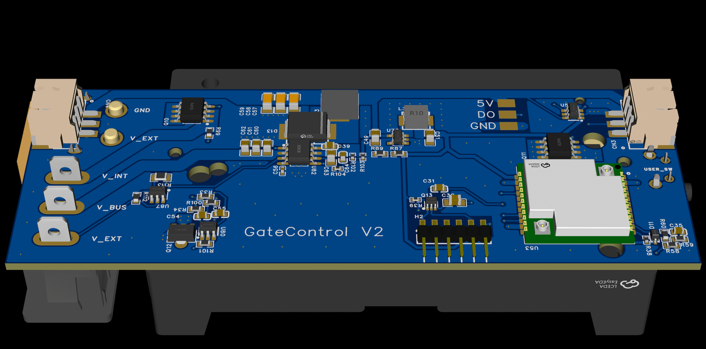
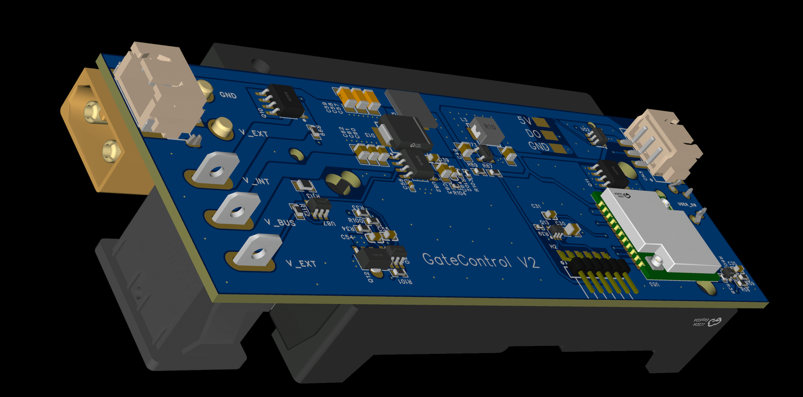
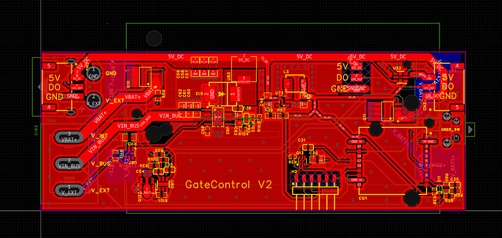

--- 
title: "LoRa Gate PCB – WLED-Powered LED Gates with Heltec HT-CT62" 
description: "The LoRa Gate PCB is a custom controller board for wireless, battery-powered LED gates, built around the Heltec HT-CT62 module (ESP32-C3 + SX1262 LoRa). It is designed for applications where multiple LED “nodes” need to be controlled reliably over long distances with minimal wiring – for example **FPV race start/finish gates**, illuminated track elements, or interactive light installations." 
category: "2025 Maker Contest" 
author: "PSi86" 
date: "2025-12-09" 
image: "img/usage.jpg" 
---

# LoRa Gate PCB – WLED-Powered LED Gates with Heltec HT-CT62

The **LoRa Gate PCB** is a custom controller board for wireless, battery-powered LED gates, built around the **Heltec HT-CT62 module** (ESP32-C3 + SX1262 LoRa). It is designed for applications where multiple LED “nodes” need to be controlled reliably over long distances with minimal wiring – for example **FPV race start/finish gates**, illuminated track elements, or interactive light installations.

The board combines **WLED**, **LoRa** and a robust power stage into a compact, production-ready form factor.

---

## Idea

Traditional LED gate prototypes often rely on loose development boards, external LoRa modules, and a tangle of wires. This quickly becomes fragile and hard to replicate when you want to scale from a single prototype to a fleet of gates.

The idea behind the **LoRa Gate PCB**:

* Create a **dedicated, rugged controller** for LED gates and similar nodes
* Use **WLED** for flexible, feature-rich LED effects
* Add a **LoRa control layer** for long-range, low-bandwidth commands (group presets, brightness, power modes, etc.)
* Build everything around a **single Heltec HT-CT62 module** to simplify RF design and reduce interference risks
* **Avoid the 2.4 GHz band entirely:** most easily available wireless solutions (Wi-Fi, BLE, proprietary 2.4 GHz links) occupy the same band used by FPV pilot radio controllers. For race safety and reliability, this band must remain free, so control of the LED gates needs to operate on a different frequency — here provided by the sub-GHz LoRa radio inside the HT-CT62.

The goal is a board that can be screwed into an LED gate, connected to a strip and a power source, flashed once – and then just works.

---

## Main Functions

* **LED Control with WLED**

  * Drives 5 V addressable LED strips (e.g. WS2812/compatible)
  * Uses WLED for animations, palettes, presets, and effects
  * Custom usermods extend WLED with LoRa-specific features

* **LoRa Wireless Control**

  * Long-range, low-power control via SX1262 inside the **Heltec HT-CT62**
  * Each gate can:

    * Join a **group** (e.g. all gates on the same track)
    * Receive **scene / preset commands** (start, finish, countdown, idle)
    * Report **status information** (battery level, signal quality, etc.)

* **Robust Power Management**

  * Designed for **portable use** (e.g. 2S Li-ion pack) and **external power**
  * Separate **5 V rail** for high-current LEDs and **3.3 V rail** for logic
  * Priority handling between power sources and undervoltage protection to avoid deep-discharging batteries

* **Event-Friendly UX**

  * Single **user button** for local control and fallback modes
  * Status indication (e.g. via onboard LED or WLED effects)
  * Configuration via WLED web UI when needed, with LoRa for day-to-day operation

---

## Typical Applications

While developed with **FPV racing** in mind, the LoRa Gate PCB is broadly applicable:

* **FPV race gates** (start/finish, checkpoints, “tunnel” elements)
* **Outdoor festival lighting**, where a central controller manages dozens of nodes
* **Temporary installations** in sports halls or event venues, where cabling is impractical
* **Interactive art projects** with distributed LED objects that need synchronized light scenes

The combination of WLED and LoRa allows fine-grained visual control with very little data over the air, which is ideal for noisy, RF-challenging environments like race events.

---

## Hardware Realization

### Core: Heltec HT-CT62 Module

At the heart of the PCB is the **Heltec HT-CT62**, integrating:

* An **ESP32-C3** microcontroller (Wi-Fi + BLE)
* An **SX1262 LoRa transceiver**
* RF front-end, matching network, and antenna connection in a proven layout

Using HT-CT62 instead of a fully discrete ESP32-C3 + SX1262 design brings several important advantages:

* **Clean RF layout out of the box**
  Critical RF paths, impedance matching and grounding are already solved, reducing the risk of:

  * Unstable LoRa links near high-current LED wiring
  * EMI issues caused by fast switching currents of LED drivers

* **Reduced PCB complexity**
  No need for a separate RF section with:

  * SX1262 placement and routing
  * Matching network and antenna tuning
  * Extra shielding measures

* **Reliability & repeatability**
  Every gate uses the same, factory-tested RF module, which:

  * Simplifies troubleshooting in the field
  * Improves consistency across a whole fleet of gates

* **Faster development & easier certification**
  The module solves a large part of the RF design problem, allowing the project to focus on:

  * Power delivery
  * Mechanical integration
  * Firmware and user experience

### Power & Connectors

The PCB is designed as a **single, compact board** that can live inside or on the frame of an LED gate:

* **Power input** compatible with battery and/or external sources
* **High-current 5 V rail** for LED strips, with attention to:

  * Wide copper traces and appropriate decoupling
  * Minimizing noise injection into the RF and MCU sections
* **3.3 V logic rail** for the HT-CT62 and other low-power circuitry
* **Connectors** for:

  * LED strips (data, 5 V, GND)
  * User button
  * Optional sensors or expansion pins

Thanks to the Heltec module, the noisy power domain of the LEDs and the sensitive RF domain are kept well-separated, which is significantly harder to achieve when routing a fully discrete SX1262 RF front-end on the same board as large LED currents.

---

## Firmware Concept

### WLED + LoRa Usermod

The firmware is based on **WLED**, extended with a custom **LoRa usermod**:

* WLED provides:

  * LED driving, effects, palettes, preset storage
  * A convenient web UI for initial configuration and debugging

* The LoRa usermod adds:

  * A **LoRa protocol** for commands like:

    * Set preset / effect by ID
    * Change brightness or color scheme
    * Assign / change group IDs
  * A **status reporting** mechanism (e.g. battery voltage, RSSI)
  * Hooks to react to race events or global triggers

In normal operation at an event, staff do not need to open the web UI. All essential control is done via LoRa from a central “Gate Controller”.

---

## Why Not a Discrete ESP32-C3 + SX1262 Design?

The project started with the idea of combining a bare ESP32-C3 and a discrete SX1262 on the same PCB. However, for a compact, high-current LED controller, this approach introduces several challenges:

* RF layout and antenna tuning become very sensitive to:

  * LED current loops
  * Ground returns and plane splits
  * Switching noise from DC/DC converters
* Each hardware revision may behave differently in terms of:

  * LoRa range and link stability
  * Susceptibility to interference

Using the **Heltec HT-CT62 module** addresses these issues directly:

* The RF part is handled by a **tested, integrated module**
* PCB design can prioritize **clean power delivery and mechanical robustness**
* Time and risk spent on RF debugging are dramatically reduced

This makes the HT-CT62 a perfect fit for a project that must **scale from prototypes to many units** that all behave predictably under real-world conditions.

---

## Project Status & Outlook

* The **LoRa Gate PCB design is complete**, and **first prototypes have been ordered**
* Next steps:

  * Validate power performance with real LED loads
  * Test LoRa range and robustness at actual FPV race tracks
  * Refine the WLED + LoRa firmware and control protocol
  * Prepare assembly instructions and documentation so others can build their own gates

By combining **WLED**, **LoRa**, and the **Heltec HT-CT62** module on a dedicated PCB, the LoRa Gate project aims to provide a **reliable, easy-to-replicate foundation** for smart LED gates and similar wireless lighting nodes in demanding environments.
