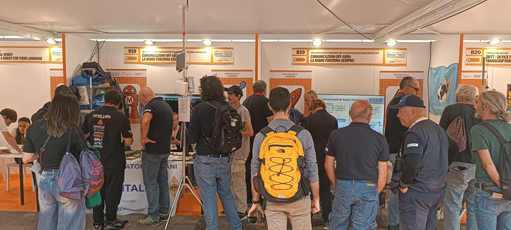
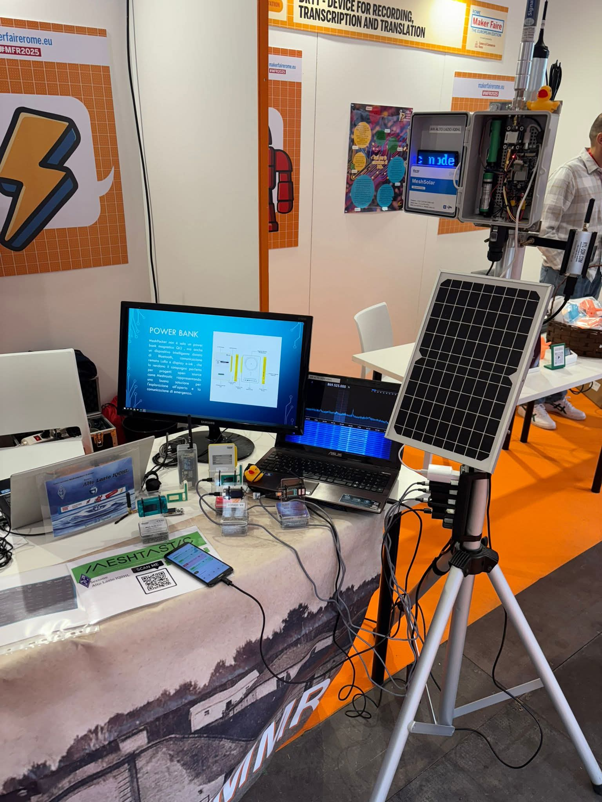
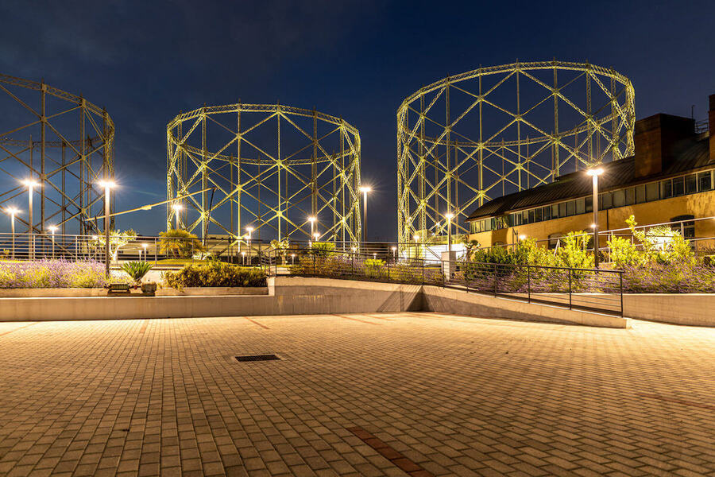

Innovation isn't just a technological issue, but a social and cultural shift. Maker Faire Rome makes innovation accessible and enjoyable to all, a showcase of passion. Being there was a deeply rewarding experience, made possible thanks to the Italian Radio Amateurs Association (Associazione Radioamatori Italiani), club of Roma Capitale APS, which for the third consecutive year presented a valuable project: "OFF-GRID radio communications, the radio always works."

The location, a former industrial site called "Gazometro," was the largest gas tank in Italy. Construction began in 1910 and it operated until the late 1960s for the distribution of gas. ENI Company began redeveloping the area in 2006. It has now become a magnificent exhibition center, featuring several industrial archaeology structures, in the heart of Rome's Ostiense district. It has become a cultural and artistic symbol of the city. The imposing structures that once held the gas can still be admired today. The train station and subway make this area ideal for trade shows, and it's the perfect location for Maker Faire!

Our stands showcased alternative methods of off-grid radio communication, demonstrating the importance of independent radio transmissions in times of need.

When presenting the Meshtastic system, I turned to Heltec Automation for valuable technical support, and I found them both helpful and competent. The Lo.Ra. transmitters are small, consume little energy, and are ideal for this purpose.

The fair was a real success, with 45,000 visitors in three days: many young people from schools, enthusiasts, and makers. Everything was very well organized, including practical demonstrations aimed especially at younger generations. Maker Faire Rome is a source of enthusiasm, passion, and innovation.

Here's a short video of the booth: https://youtu.be/d0CWWaHnym8?si=2iUbJoMDdb46mdlL

Greetings to the entire community and thanks again to Heltec Automation

**Fabio IZ0QPO**

Associazione Radioamatori Italiani – Sezione Alto Lazio IQ0HL

- [www.arialtolazio.it](www.arialtolazio.it)
- [makerfairerome.eu](makerfairerome.eu)

