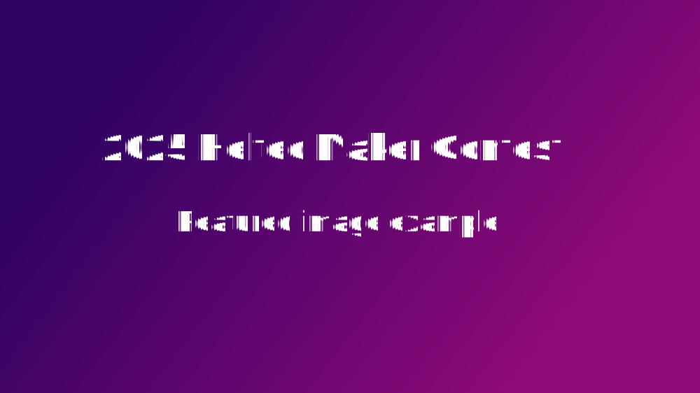

:::tip
The above is the `Frontmatter` content. This part of the content will **NOT** be displayed in the main body of the document, but it is very important index information. The content corresponding to the field should be relevant to your project.
:::

:::note
In the `Frontmatter` content, the author's name must be the same as the name submitted during registration. This is the unique identifier that matches your article.
:::

## Your project title

<!-- truncate -->

:::tip
A horizontal image that shows your final work or the effect you achieved, with a recommended ratio of 16:9 (Not mandatory), such as 1000 x 562 resolution. `svg`, `png`, `jpg`, `jpeg` are fine.

This image serves two purposes:
1. As a feature image on the homepage;
2. As a showcase for your final work or the effect you achieved.
:::

A brief summary of what your project is doing, what it achieves, what problems it solves, etc.

:::note
The above content is **required** (Except for the tips in the tip and note boxes), and the following content is recommended but not required. You can freely play according to your actual situation.
:::

### Your project story
What is your original intention in making this thing or project? Or the interesting things behind this project.

### preparation
What items and quantities are needed for your project? It would be best if you could provide a purchase link or indicate the source. This would make it easier for others to replicate.

For example:
- [WiFi LoRa 32 V4](https://heltec.org/) x 1
- [HT-M02 Edge LoRa Gateway](https://heltec.org/) x 1
- [IIC temprature sensor](https://www.aliexpress.com/) x 1

### Implementation process
Please provide as much detail as possible on how your work was implemented, including the logic of hardware connection, your system arctecture, etc. You can insert some photos or videos in this part of the content. It would be great if you could open source your code.

### Finished project showcase / Summarize
This section is used to showcase and explain the final results of your project.

Or make a summary of what you have done and what upgrades may be made in the future.