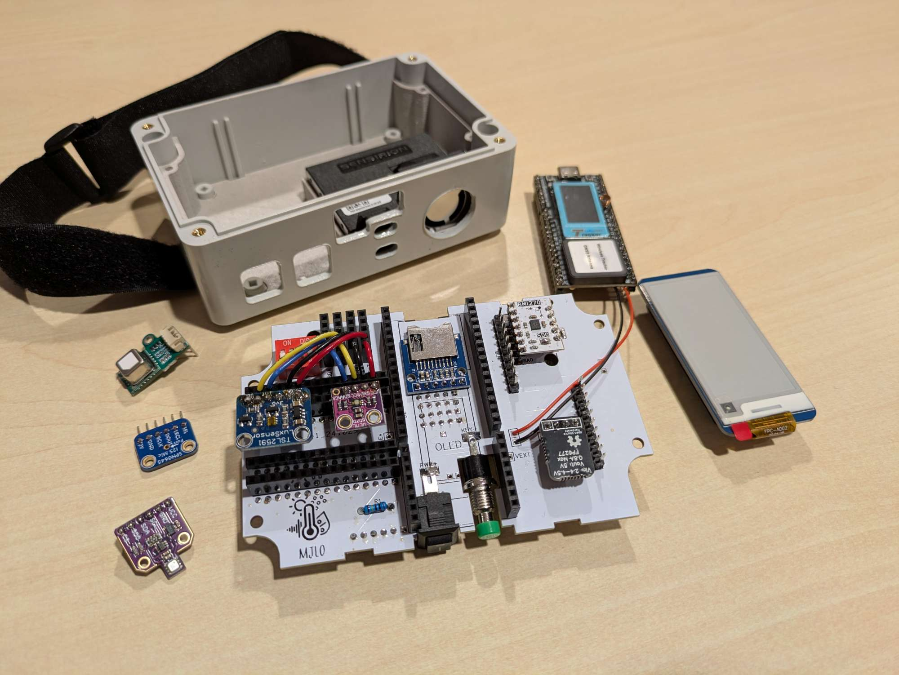
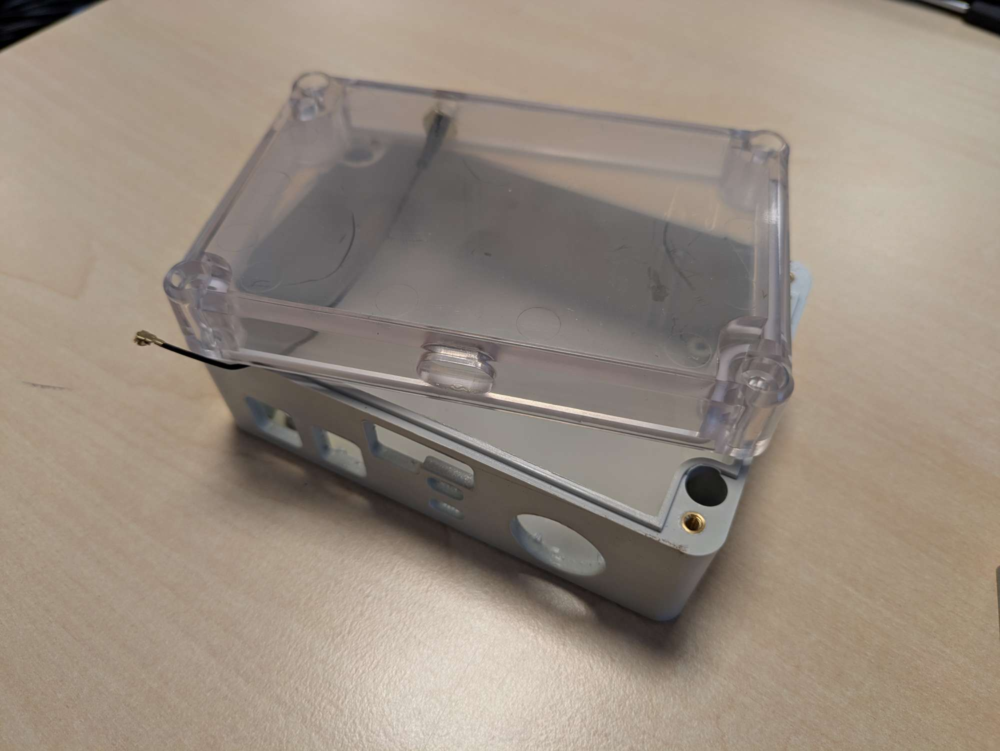
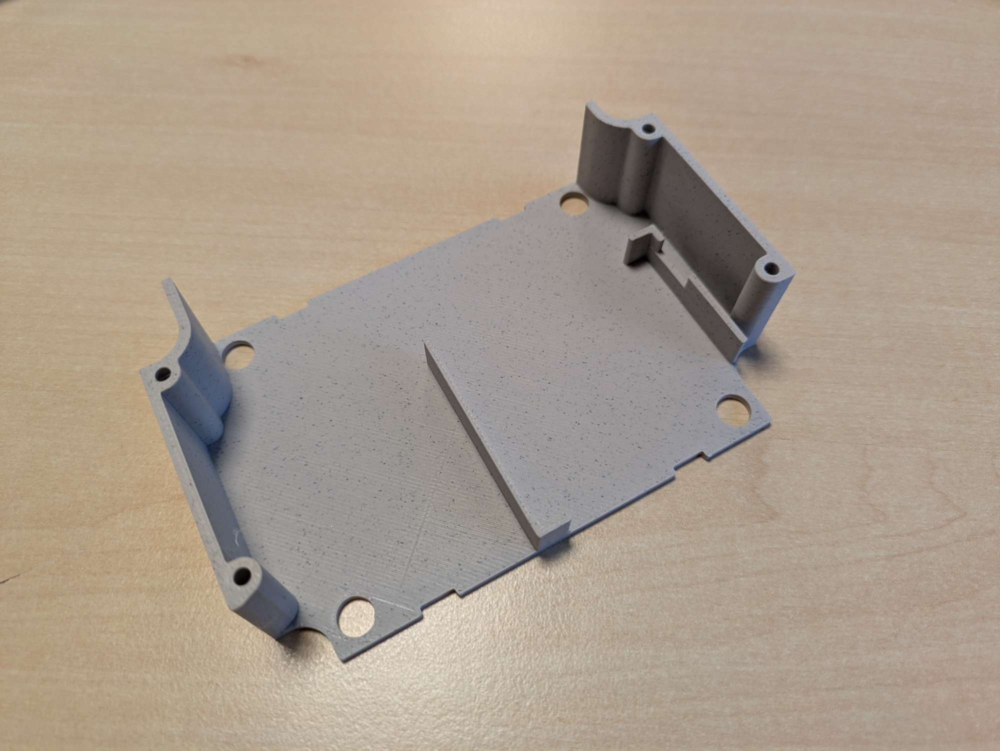
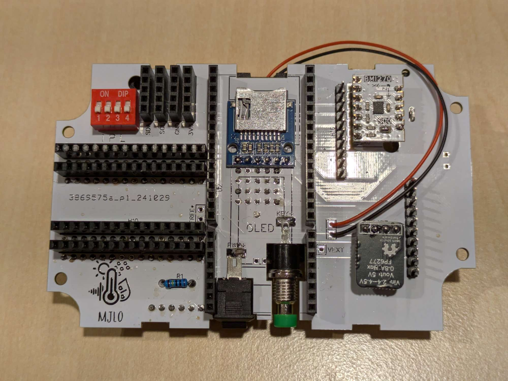
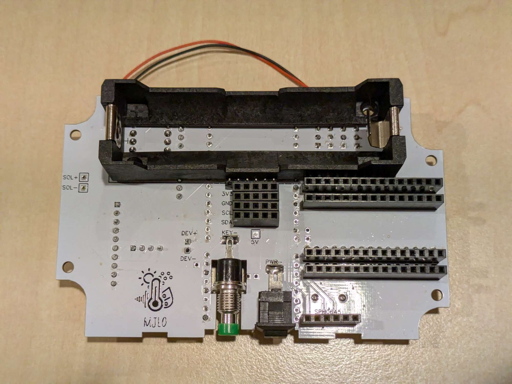
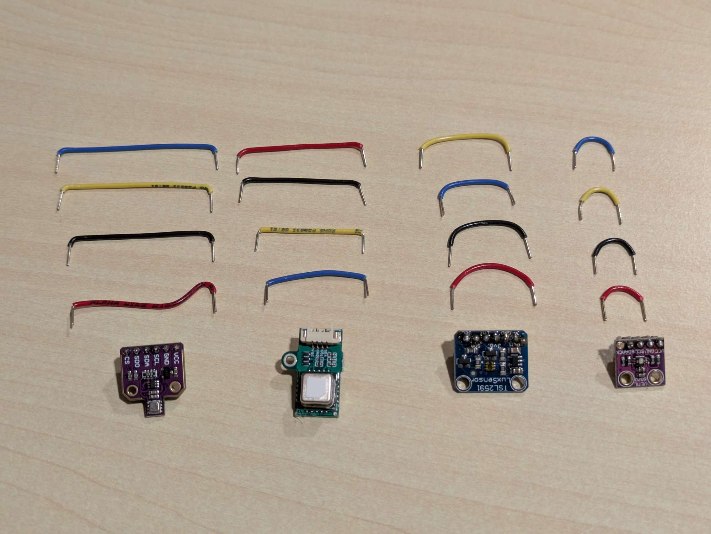
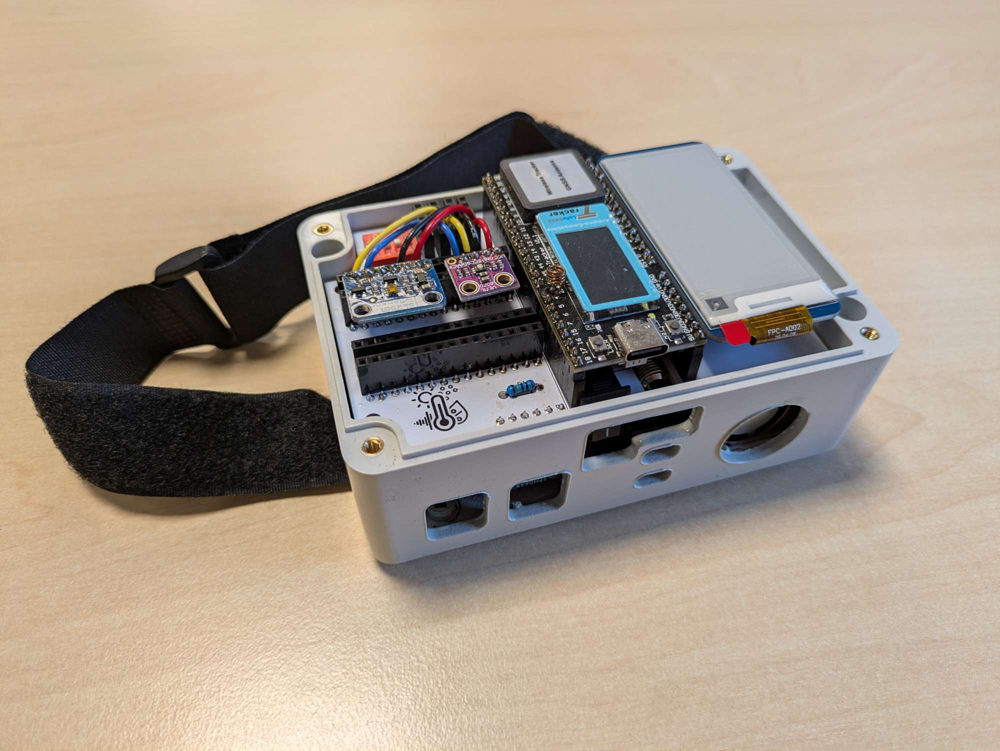
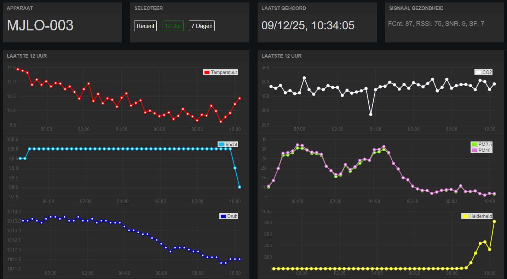
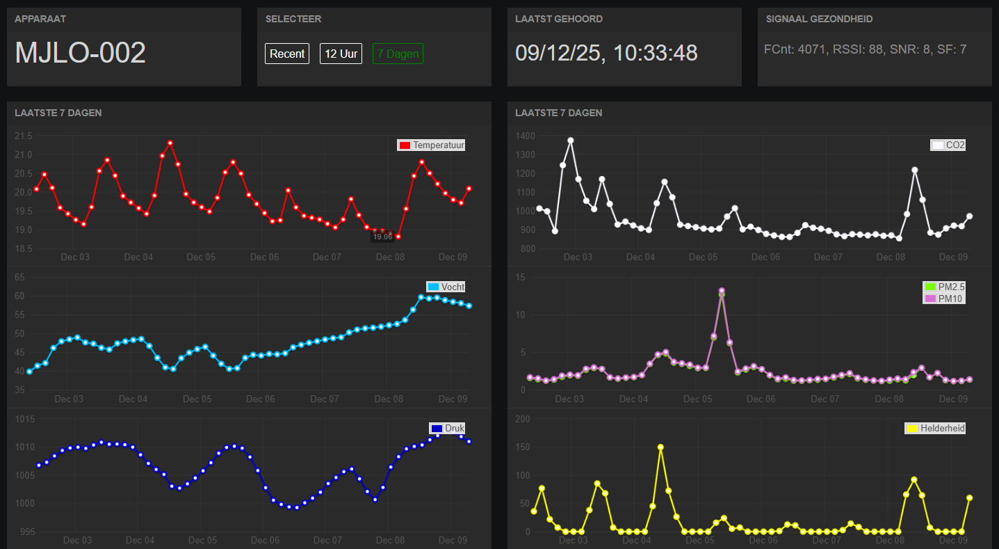
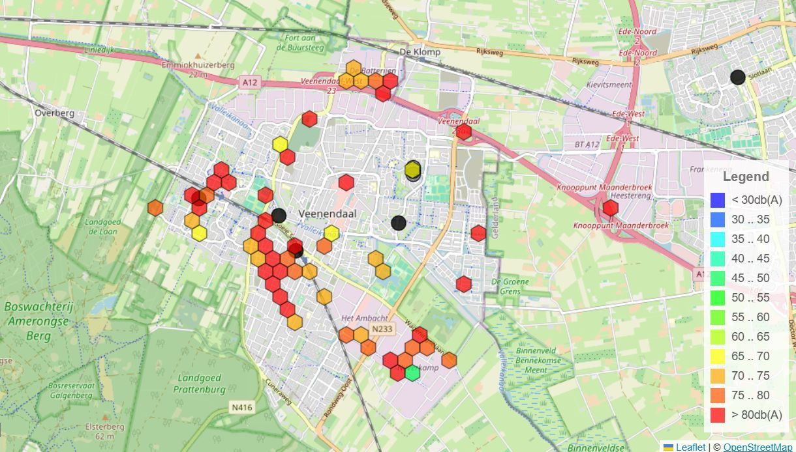

## Measure Your Living Environment

<!-- truncate -->

Measure Your Living Environment (or MYLE) is a project by Steven Boonstoppel, an IT teacher at Ichthus College Veenendaal (Netherlands), who builds portable sensor boxes to help students explore and understand their local environment.

Developed with support from local government and schools, the project equips high-school students with LoRaWAN-connected sensor boxes that measure temperature, humidity, air pressure, noise, air quality (CO₂, particulate matter, VOCs), and more. Students take the boxes home or place them around town for a few weeks; every 15 minutes the device wakes, records sensor data, and sends the results via The Things Network.

The goal is simple: use real data to make learning tangible. Students discover why paved areas are hotter than green ones, how traffic affects noise and air quality, and what “quality of life” looks like in measurable terms. Instead of guessing or working with hypothetical numbers, they work with live data from their own environment — building math, science, and research skills along the way. Students learn to collect, analyze and interpret measurements (e.g. why a paved backyard is warmer than a green one), linking math and science skills to concrete local issues. 

### The project goal and requirements
Classes in school can be quite abstract or theoretical. How much more interesting is it to go outside and learn all about your own living environment! To that end, Steven started a project to make this possible. With a sensor box on battery and wireless communication, students are able to gather information about their street, playground, the school environment, the difference between plants and tiles, the effect of a highway, and so on. 
The requirements are ambitious:
- A handy box that can be transported and mounted anywhere.
- Battery-powered that can survive at least two weeks, aiming for a full month.
- Wireless communication without manual steps (ruling out WiFi and Bluetooth).
- No subscription; only a purchase cost (ruling out subscription-based communication such as LTE).
- A total cost that doesn't scare away schools or institutes.
- Being able to purchase and build it yourself or as a student (with some soldering tools and a little skill).
- As many environmental sensor as possible to cover a wide range of research projects.
- Location service through GPS to correlate measurements with location.

### A proof of concept
The project began in 2020 with an early prototype built mainly to test feasibility. This first version intentionally ignored some requirements (size, power, ease of assembly), but the results highlighted several problems.

- The Pycom microcontroller consumed too much power, struggled with LoRaWAN, and lacked enough GPIO pins — and shortly after, Pycom went bankrupt.
- The jumper-wire approach caused unreliable connections during transport.
- Glue-mounted parts detached in hot or cold weather.
- The internal “sticker” antenna gave poor LoRa coverage.
- The OLED display had to turn off after a few seconds due to power limits.

Many of these issues were fixable with enough time, but the platform limitations and large size made the prototype unsuitable for student use — especially since a full batch of 60 units had already been built.

With support from the local municipality and water authority, the project restarted with a clean slate. Using everything learned from the prototype, the box was redesigned from the ground up: one-quarter the size, true deep-sleep support, more I/O, better durability, and an e-ink display. What’s inside this improved version? Read on!

### The box

The greatest thing in the sensor box is Heltec's Wireless Tracker. Not only because this article is a contest entry, but because the hardware is actually great, especially for the value. The best part is the UC6580: a powerful GNSS chip. The sensor box namely has three enemies: the GNSS chip, microphone and the PM sensor. A crucial part is being able to quickly find the box's location. The longer it takes to find a fix, the shorter the remaining battery life. As well as worse tracking while it is actively moving. 
But moreover, where the prototype was severely limited by the number of pins, the Tracker has enough to accomodate all wishes. Some hacks had to be made, but everything works nonetheless. Including a backup SD card slot: the box logs all its measurements and if there was no coverage, an SD card can be inserted to restore all missing uplinks.  
Also, the Tracker features (just as all other recent Heltec products) a very low power consumption during deepsleep, with only ~17 microamps being used. Some sensors unfortunately do add to this, but any improvement is welcome.

As the boxes are often in a public spot (although generally slightly hidden), Steven ensured that passersby also understand what the box is about. This is where the e-ink display is useful: even while the box is asleep, everyone can check out the latest measurements - and see that it is not just a camera spying on them.

In its default configuration, the box has about three to four weeks of battery life. This is generally enough for the student projects, and if it isn't, then it is easily charged using a standard USB-C cable in about half a day. By default, the box measures every 15 minutes. Most things don't change that quickly: the temperature does not suddenly spike by a few degrees, nor does the CO2 level outdoors. However, for some projects, it can be useful to measure faster. If noise is a concern, listening for 30 seconds every 15 minutes may not be enough. That is why some DIP switches are included that unlock other modes, including an active mode where it is measuring every 30 seconds. To prevent overloading LoRaWAN, measurements are only saved internally in this mode and can be retrieved by inserting an SD card.

There is much more to tell, but at this point it may be more interesting to have a look at a (dis)assembled box.. 

### At a glance

| Feature | Specification |
|--------|---------------|
| **Battery life** | 3–4 weeks (with 15-minute interval) |
| **Measurement interval** | Default 15 min; optional high-rate mode |
| **Wireless communication** | LoRaWAN (SX1262) via The Things Network |
| **GNSS** | UC6580 |
| **Microcontroller** | Heltec Wireless Tracker (ESP32-S3) |
| **Sensors included** | PM (SEN55), CO₂ (SCD41), TPH (BME280), UV (AS7331), light (TSL2591), microphone (SPH0645), accelerometer (LSM6DSR) |
| **Storage** | microSD slot for offline logging / backfill |
| **Display** | Waveshare 2.13" e-ink |
| **Sleep current** | ~17 μA base (plus sensor overhead) |
| **Battery** | 21700 Li-ion (~5000 mAh) |
| **Enclosure** | IP65 ABS box (118 × 78 × 55 mm) |
| **Approx. cost** | ~€180 / ~$210 per box (excl. shipping) |

### Parts list
With the exception of the PCB, all components in the box can be purchased off-the-shelf depending on where you live. As Steven is from the Netherlands, the purchase list will include both international and NL-local purchase links.

Neglecting shipping costs, the total hardware price is roughly $210 / €180. If you are building one or two boxes, the price per box can become a bit more expensive due to shipping.

- [Heltec Wireless Tracker](https://heltec.org/project/wireless-tracker/) ([NL](https://www.tinytronics.nl/en/development-boards/microcontroller-boards/with-gps/heltec-wireless-tracker-v1.1-esp32-s3-sx1262-lora-868mhz-gnss-with-0.96-inch-tft-display))
- [SEN55 PM sensor](https://www2.mouser.com/ProductDetail/Sensirion/SEN55-SDN-T?qs=MyNHzdoqoQLyWUzejWkZfg%3D%3D) ([NL](https://www.tinytronics.nl/nl/sensoren/lucht/vochtigheid/sensirion-sen55-sdn-t-omgevingssensor-fijnstof-luchtvochtigheid-temperatuur-voc-nox)) - _make sure to include the associated [cable](https://www2.mouser.com/ProductDetail/Sensirion/SEN5x-Jumper-6-pin-cable-set?qs=1Kr7Jg1SGW%252BR386X9%2FGSqw%3D%3D) ([NL](https://www.tinytronics.nl/en/cables-and-connectors/cables-and-adapters/jst-compatible/jst-ghr-06v-s-to-dupont-female-compatible-cable-6p-15cm))._
- [SCD41 CO2 sensor](https://www.aliexpress.com/item/1005007402021824.html) ([NL](https://www.tinytronics.nl/en/sensors/air/humidity/gy-scd41-module-co2-humidity-temperature-sensor-i2c)) - _be sure to select the SCD41, not the SCD40._
- [BME280 TPH sensor](https://www.aliexpress.com/item/1005006953448721.html) ([NL](https://www.tinytronics.nl/en/sensors/air/pressure/bme280-digital-barometer-pressure-and-humidity-sensor-module)) - _AliExpress pretty much only has clones._
- [AS7331 UV sensor](https://www.aliexpress.com/item/1005007944993656.html) ([NL](https://www.tinytronics.nl/en/sensors/optical/light-and-color/as7331-uv-light-sensor-module))
- [TSL2591 Light sensor](https://www.aliexpress.com/item/1005008721729329.html) ([NL](https://www.kiwi-electronics.com/nl/adafruit-tsl2591-high-dynamic-range-digital-light-sensor-stemma-qt-1636))
- [SPH0645 Microphone](https://www2.mouser.com/ProductDetail/Adafruit/3421?qs=AQlKX63v8RvZGoQRFfPrCQ%3D%3D) ([NL](https://www.digikey.nl/nl/products/detail/adafruit-industries-llc/3421/6691114))
- [LSM6DSR Accelerometer](https://moffshop.deyta.de/products/lsm6dsr)
- [Waveshare E-ink display](https://www.waveshare.com/pico-epaper-2.13.htm) ([NL](https://www.tinytronics.nl/en/displays/e-ink/waveshare-2.13-inch-e-ink-e-paper-display-for-raspberry-pi-pico))
- [MicroSD reader](https://www.aliexpress.com/item/1005005591145849.html) ([NL](https://www.bitsandparts.nl/SD-Card-Reader-Kaartlezer-breakout-board-module-SPI-Mini-p1929523)) - _The breakout board should come without the headers soldered._
- [Voltage regulator](https://labcrafter.co.uk/products/5v-boost-converter-with-true-shutdown)
- 21700 battery ([NL](https://www.tinytronics.nl/en/power/batteries/21700/samsung-21700-li-ion-battery-4900mah-9.8a-inr21700-50e)) - _No international link provided, since batteries should be purchased as close to home as possible. Try to find an unprotected ~5000mAh battery, such as the Samsung INR21700-50E._
- [21700 battery holder](https://www.aliexpress.com/item/1005005518599950.html) ([NL](https://www.tinytronics.nl/en/power/battery-holders-and-clips/21700/1x-21700-battery-holder-for-pcb))
- [Box](https://www.tme.eu/nl/en/details/z57jph-tm-abs/multipurpose-enclosures/kradex/z57jph-tm-abs/) ([NL](https://www.tinytronics.nl/en/tools-and-mounting/enclosures/universal/kradex-enclosure-118x78x55mm-ip65-grey-transparent-z57jph-tm-abs))
- [PCB](https://www.kroonos.tech/shop/meet-je-leefomgeving-pcb/)
- [Small components](https://www.kroonos.tech/shop/meet-je-leefomgeving-components/) - _To mount all boards and sensors to the PCB, you will need a bunch of headers, pins, buttons and some wires. You can purchase these at the same store as the PCB. If you want to gather these yourself, you can view the contents of the bundle at the store listing._

:::tip  
The Heltec antenna provided with the Wireless Tracker is decent, but there are antennas with better performance, such as this one:  
[RF Solutions ANT-8WIRE-SMA](https://www.rfsolutions.co.uk/antennas/antenna-flexi-wire-1-4-wave-868mhz-sma/)  
:::

:::note  
If you do not have a LoRaWAN gateway and do not have a known usable gateway nearby, you will need to purchase one, such as this one:  
[HT-M02 Edge LoRa Gateway](https://heltec.org/project/ht-m02-v2/)  
:::

### Implementation process

---
#### **Preparing the box**
To prepare the box, you will need a laser cutter and a 3D-printer. If you don't have these available, feel free to send an email to the Kroonos webshop (see the PCB), and Steven may be able to sell the printed and cut items there as well.

The box needs some holes cut for the antenna, accessing the buttons and charger and providing ventilation for the sensors. For the necessary files and instructions, see https://github.com/Ichthus-College-IN/MJLO-hardware. It is recommended you get an additional box which can be sacrificed to find the appropriate settings for your laser cutter. Be warned that a 10W laser may not cut through the plastic sufficiently; a 40W laser is recommended. Also: the fumes that are released during cutting are quite bad. Use good ventilation and consider wearing a face mask while you're working on this. Thanks to covid, everyone should have some masks around!

The PCB is screwed to a 3D-printed carrier, which can be slid neatly into the box, holding everything in place. This 3D print does not require much precision: any older printer will do, even with a 0.3mm layer thickness. Depending on the printer and settings, printing a carrier takes anywhere from 0h45m to 2h00m. The colour doesn't matter as this goes inside the box. Steven uses PLA without problems so far, but maybe for longevity, it can be better to use ABS.

:::tip  
Refer to the [hardware repository](https://github.com/Ichthus-College-IN/MJLO-hardware) for more detailed instructions!  
:::

---
#### **The hardware**
To assemble the PCB, refer to the images below. It shows where all headers and pins are located (on the top and bottom side). Please note that you cannot simply first solder everything to the top side and then the bottom, since you will not be able to solder everything in this case. Step-by-step building instructions are a work-in-progress. For reference, here are a picture from the top and bottom of the PCB for anyone interested:

After soldering all pins and headers, cut and strip some solid-core wires for four of the sensors:

Once all sensors are inserted, you can put the carrier into the box and put the PCB on top of it. As a result, your box should look like this:

---
#### **The software**
The code is a PlatformIO project, and is available at https://github.com/Ichthus-College-IN/MJLO-firmware with an MIT license, meaning that you can use and adapt the code however you see fit. If you think that you can add a meaningful contribution, you are more than welcome to open a pull request or open an issue or discussion. 

Instructions are available at the repository, but are as simple as this:
1. Connect your sensor box with a USB-A to USB-C cable.
2. Put the microcontroller into Download / bootloader mode. To do this, press and hold the USER button, then press and release the RST button while holding USER, and finally let go of the USER button.
3. From the PlatformIO extension tab, perform "Upload Filesystem Image". This is a necessary step.
4. Finally, perform the "Upload" action, and reset the microcontroller once uploading has completed.

### The dashboard
Working with students also means that it is crucial to capture their attention. That is why Steven built a dashboard (with the help of Nick codenamed 'descartes'). There is a dashboard for the measurements of each individual box - see for instance the latest 12 hours of measurements for the box in the first image of the post:

There are also graphs for 7 days of data - see for instance https://www.meetjeleefomgeving.nl/mjlo-002 which is measuring in a storage room at school. Fun fact: the Dutch edition of Santa Claus (Sinterklaas) is celebrated the 5th of December and legend says he brings presents by entering the house through the chimney - the image clearly shows some polluting activity this day in the Particulate Matter graph on the right!

Besides the individual graphs, there is a map where measurements can be compared easily between different boxes across town or elsewhere - see https://db.meetjeleefomgeving.nl (this is very much a work in progress and measurements may not be publicly available all the time). Here, we can easily compare for instance the maximum loudness measured in different parts of town:

While there is so much available open source for microcontrollers, sensors and firmware, making databases and dashboards is much harder. And because it is so time consuming and difficult, the solutions that do exist are almost all paid - the ones that are free are usually strongly limited in number of devices are only save data for a few days or weeks.  
Currently, Steven is setting up InfluxDB3 Enterprise with a 'Home-use' license (a school isn't an enterprise but much more a community) - this license is limited in number of compute, but as long as you bring your own server and storage, you can do anything you want. The goal is to install Grafana alongside and create new materials for Steven's SQL lessons. Then students can even investigate their living environment during IT classes!

### Student projects
Steven's dream is starting to come true: with these boxes, students are starting to learn more about their own living environment and even contributing to their municipality. For instance recently, three groups of students (roughly 16 years old) started a project for the municipality of Veenendaal (where the school is located). As kickoff, an employee of the municipality gave an introduction to their research topics. Then, the students created a research proposal and visited the town hall to discuss their plans with a few employees. After they refined their proposal based on the feedback, each group deployed six devices across the city in various locations. Currently, they are processing the data to formulate a conclusion for their research question. In about a month, they will revisit the town hall to present their conclusions and give an advice to the municipality for future improvements in the city.

The topics they are researching are these:
1. Is there any difference between old-style playgrounds and new-style playgrounds? Students are comparing temperature, CO2, UV and particulate matter concentrations. (Steven's personal tip: also measure noise, because the new playgrounds have softer tiling and more vegetation!)
2. In which parts of town is quality of life best? Students investigated what 'quality of life' actually means and decided to focus on temperature, UV and particulate matter, comparing an older neighbourhood with industrial estate, a park and the city centre. 
3. What is the effect of greenery on the living environment? The students are measuring humidity, noise, temperature, CO2 and particulate matter concentrations. 

We hope that our students can answer these questions and contribute to the municipality with useful data and conclusions!

### The power of LoRaWAN and sharing
One of the coolest things about the project and the LoRaWAN network is that the boxes are not just limited to be used by our college in Veenendaal. We are also sharing the boxes with other schools in town (where ~13 year olds are doing research for the municipality as well) and a few months ago, students even took the boxes to Switzerland to do research on different altitudes! Because there is a public gateway on The Things Network connected in the valley where they went, they could just as easily measure on the slopes of the mountain during their hikes.  
And we are not the only ones building boxes. A school in the next town over recently purchased the required hardware for 25 boxes for themselves, and are building the boxes with their students to be used next year.

:::info  
**The Things Conference 2024**  
In 2024, Steven was invited to give a short keynote on the project at The Things Conference. Here, he tells the story of the boxes and students for anyone interested to hear more about the project:
https://www.youtube.com/watch?v=r3B2SR7buZk  
:::

### The future?
With the project starting to gain traction, Steven is currently mostly looking forward to collaboration with others. After soloing the project for roughly five years, it's time to share the knowledge, send out the boxes to colleagues and students for projects, and documenting everything. But secretly, he's still looking for improvements to the dashboard: especially the map needs more work, as well as trying out InfluxDB and Grafana. And maybe the box can be improved as well - improving the battery life or sensor reliability is always welcome :)

:::tip  
The Dutch name of the project is "Meet je Leefomgeving" (MJLO for short) and can be found at https://www.meetjeleefomgeving.nl/. Recently, the English domain name https://measureyourlivingenvironment.com was added, pointing to the Dutch website for now. Later, an English version will exist there.  
:::
