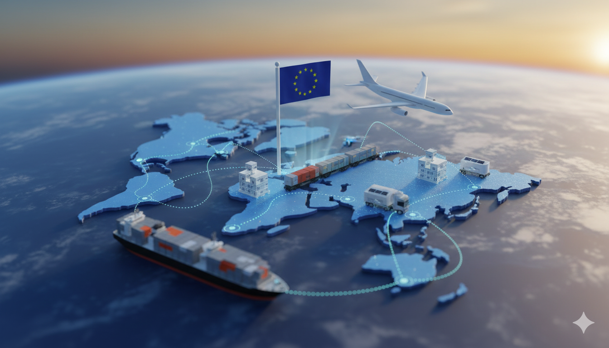

# Warehouse Operations & Fulfillment
We operate a strategic network of warehouses to optimize shipping efficiency and delivery times for our customers worldwide.

## Warehouse Selection and Split Shipments

**Priority Fulfillment**
While you may select a preferred warehouse during checkout, we will always prioritize shipping your order from the nearest available warehouse to your location to minimize transit time.

**Split Shipments** If your order contains items sourced from different inventory locations (warehouses), the items will be shipped separately and will arrive in multiple packages with individual tracking numbers.

:::note
We utilize geographically located warehouses to offer faster shipping to key regions. If your specific location is not listed under a regional warehouse, your order will be fulfilled and shipped from our China Warehouse.
:::
 

### German Warehouse Supported Countries:

Austria, Belgium, Bulgaria, Croatia, Czech Republic, Denmark, Estonia, Finland, France, Germany, Hungary, Ireland, Italy, Latvia, Lithuania, Luxembourg, Malta, Netherlands, Norway, Poland, Portugal, Romania, Slovakia, Slovenia, Spain, Sweden, Switzerland, United Kingdom.

### US Warehouse Supported States/Regions:
**South** Alabama, Arkansas, Delaware, Florida, Georgia, Kentucky, Louisiana, Maryland, Mississippi, North Carolina, Oklahoma, South Carolina, Tennessee, Texas, Virginia, West Virginia.
**Midwest** Illinois, Indiana, Iowa, Kansas, Michigan, Minnesota, Missouri, Nebraska, North Dakota, Ohio, Pennsylvania, South Dakota, Wisconsin.
**West:**
West: Arizona, California, Colorado, Idaho, Montana, Nevada, New Mexico, Oregon, Utah, Washington, Wyoming.

Northeast: Connecticut, District of Columbia, Maine, Massachusetts, New Hampshire, New Jersey, New York, Rhode Island, Vermont.

:::note
Not Supported from US Warehouse: Alaska, Hawaii, Puerto Rico.
:::

---

# Special Shipping Conditions and Restrictions

This section covers specific carrier mandates and fulfillment restrictions related to product type and destination.

### Express Shipping Advisory (Battery Products)
We generally recommend limiting the use of premium express courier services (like FedEx or DHL) for Integrated Battery and Pure Battery products.

:::caution WARNING: High Cost and Inspection Risk
Express shipping channels for battery products incur **significantly higher shipping fees** and are subject to an **increased rate of customs inspection** due to strict aviation safety regulations.
:::

### Mandatory Carrier for Russia (Official Website)
All orders placed on the Official Website destined for **Russia** must be shipped using the following dedicated channel:

* **Carrier:** China Post Shenzhen Offline ePacket (General Goods)

---

# Customs and Import Advisory

### Mandatory Tax ID for Customs Clearance
For orders shipped to the following countries, customers **must** provide their mandatory local tax identification number (or equivalent ID) during checkout to ensure compliance and prevent shipping delays:

* **Brazil**
* **India**
* **Mexico**
