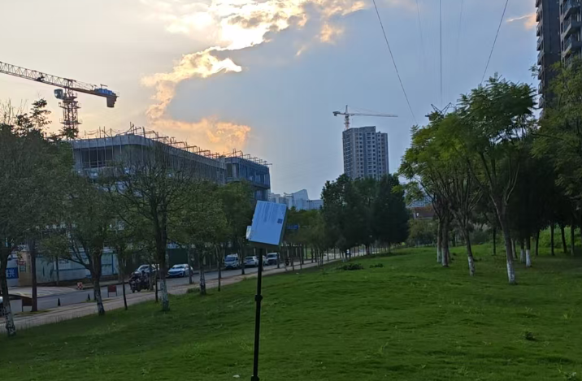
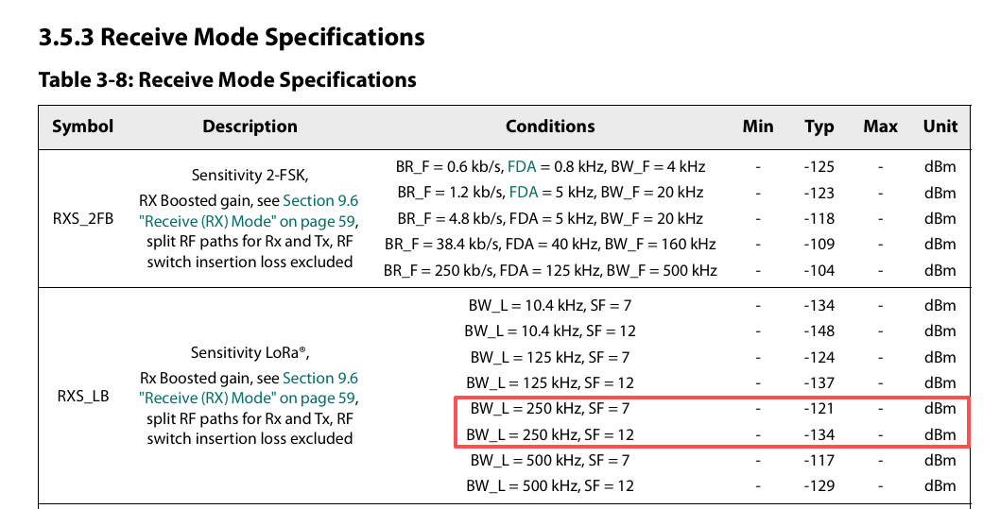
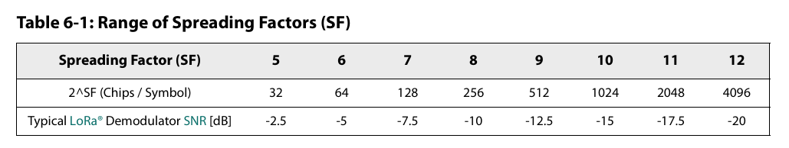
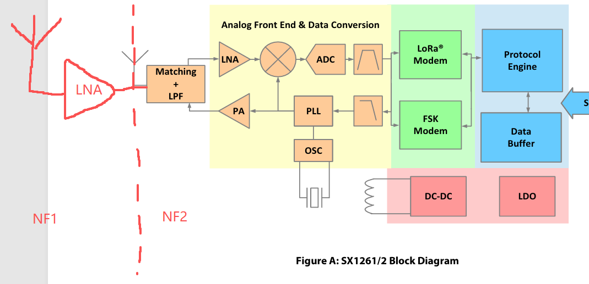
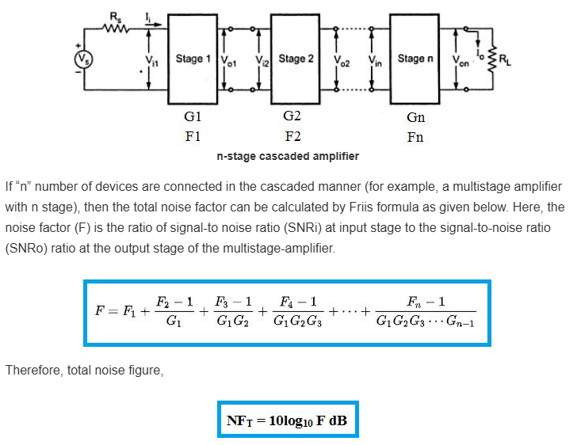
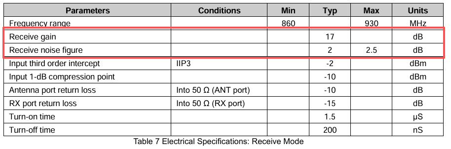
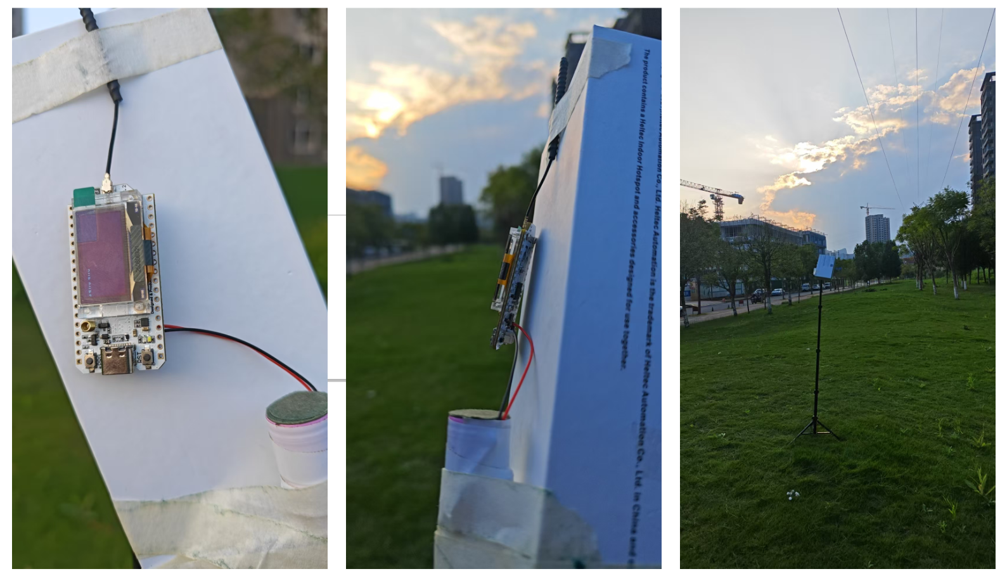
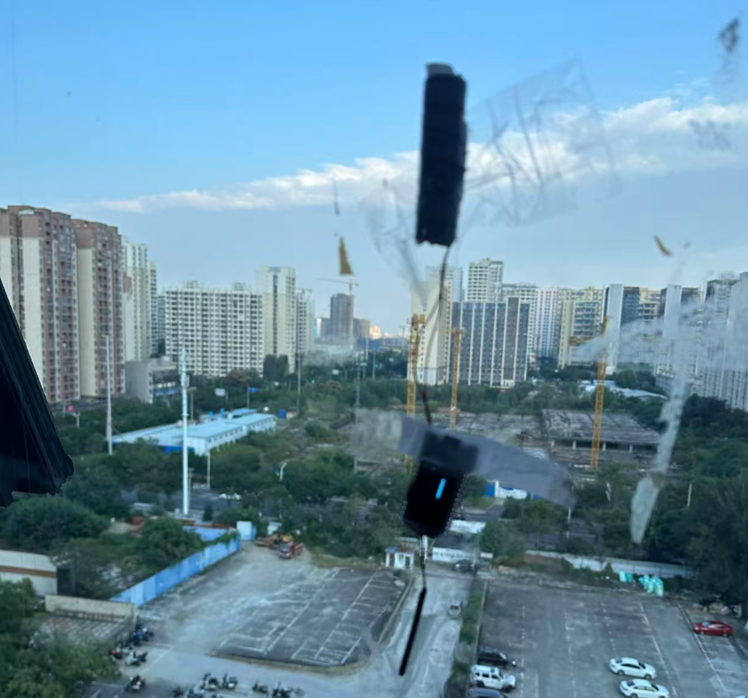
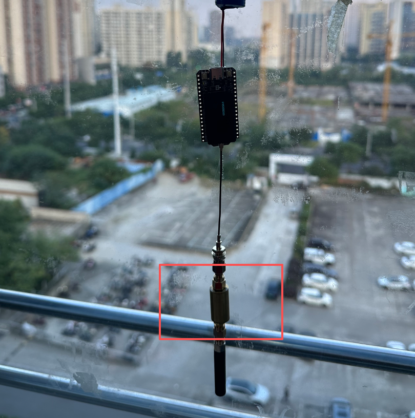

Recently, some users reported concerns about the LoRa 32 V4 receiving sensitivity. We ran a series of controlled tests to validate performance and isolate possible causes. This document provides a detailed breakdown of the test process and technical interpretation.

<!-- truncate -->

### The concept of LoRa RSSI & SNR
Before diving into test data, let's align on key concepts：
- SNR --  Signal to Noise Ratio
- RSSI -- Received signal strength indicator

`RSSI(signal) - RSSI(noise) = SNR`

- If `SNR > 0`, RSSI refers to the signal’s strength.
- If `SNR < 0`, RSSI represents the noise level.

The key advantage of LoRa spread-spectrum communication is its ability to decode signals even below the noise. However, this range is has limits.

#### Without LNA：
The decodable range can be estimated using the two reference tables in the SX1262 datasheet.

Under Meshtastic's `LongFast`mode，when `BW = 250k`, `SF = 11`，the theoretical LoRa receiver sensitivity is about `-130dBm`.

Under different spreading factors, the typical SNR limits for are shown below：


:::tip Good News
The values above are typical value. The good news is that the actual SNR limit can be even higher. In Meshtastic’s LongFast mode, SNR can sometimes reach -20 to -22 dB.
:::

For example, when the `RSSI(signal) = -130dBm` and the `RSSI(noise) < -110dBm`, and the `SNR < -20 dB`, now the signal can still be received and decoded.

<span style={{ color: 'yellow' }}>
**In conclusion, when evaluating reception quality, you can not rely solely on RSSI value. When SNR is positive, RSSI is meaningful; when SNR is negative, SNR data becomes more critical.**
</span>

### Lets's return to this topic

This is the RSSI value measured — but what about the SNR? When the SNR is negative, the SNR value must also be taken into account.

#### With LNA
The LoRa 32 V4 has an FEM chip (GC1109), which includes an LNA amplifier on the receive path. This forms a two-stage cascaded system.


According to [Friis formula](https://www.everythingrf.com/rf-calculators/cascaded-noise-figure-gain-calculator)


The total noise figure for our two-stage cascaded system is given by：`NF(total) = NF1 + (NF2 - 1)/G1`

Refer to the GC1109 datasheet for details.


Therefore：
```
NF1 = 2dB ≈ 1.6; //The calculation requires converting dB units into linear units
G1 = 17dB ≈ 50;
NF2 = 6dB ≈ 4; //NF2 is the noise figure of SX1262, but I did not find this number in the datasheet. value 6dB is from AI.

NF(total) = 1.6 + (4 - 1)/50 = 1.66 ≈ 2.2dB

Optimizes Noise Figure: NF2 - NF(total) = 6 - 2.2 = 3.8dB
```
:::note Conclusion
The LNA added to the receiving chain theoretically optimizes the noise figure of the entire system is 3.8dB.

Keep this theoretically derived value -- **3.8dB**。
:::

But does reality match theory? We conducted experiments to verify this.

### Experimental Verification

In fact, we performed similar tests during the R&D phase. Today, to address users’ questions, we repeated the experiment.

- Transmitter: LoRa 32 V3 (both 868 MHz and 915 MHz used the same transmitter, 250 kHz BW, SF11)

Tests were conducted in an urban environment with partial building obstruction, at distances of 1.5 km and 2 km from Heltec office.


- Receivers (total 4)
    - LoRa 32 V3 x 2 (V3A, V3B)
    - LoRa 32 V4 x 2 (V4A, V4B)

The receivers were impleted on the office glass.


At 868 MHz and 2 km distance, the average values from multiple tests for the four receivers are shown in the table below:
|  Code Name  |     RSSI     |     SNR     |   Packet loss rate   |
|-------------|--------------|-------------|----------------------|
|     V4A     |     -94      |     -14     |          8%          |
|     V4B     |     -94      |     -12     |          4%          |
|     V3A     |     -109     |     -16     |          19%         |
|     V3B     |     -110     |     -17     |          23%         |

At 868 MHz and 1.5 km distance, the average values from multiple tests for the four receivers are shown in the table below:
|  Code Name  |     RSSI     |     SNR     |   Packet loss rate   |
|-------------|--------------|-------------|----------------------|
|     V4A     |     -93      |     -13     |          8%          |
|     V4B     |     -94      |     -12     |          3%          |
|     V3A     |     -109     |     -15     |          5%          |
|     V3B     |     -109     |     -15     |          20%         |

At 915 MHz and 1.5 km distance, the average values from multiple tests for the four receivers are shown in the table below:
|  Code Name  |     RSSI     |     SNR     |   Packet loss rate   |
|-------------|--------------|-------------|----------------------|
|     V4A     |     -95      |     -14     |          3%          |
|     V4B     |     -95      |     -13     |          8%          |
|     V3A     |     -109     |     -18     |          20%         |
|     V3B     |     -109     |     -18     |          27%         |

Based on the experimental results above, what did you observe? The SNR difference between V3 and V4 is consistently around 3~4 dB, which aligns exactly with our earlier theoretical analysis!

Thus, we can conclude：**The V4 with the added LNA has superior receiving performance compared to V3!**

:::note P.S.
In mainland China, personal use of the 863–870 MHz and 902–928 MHz bands is not allowed, as these frequencies are used by our CDMA and GSM networks. Consequently, the noise levels in these bands are higher.

Heltec have always adhered to the principle of “theory as guidance, experiments as verification.” We welcome users to test, verify, and discuss their findings.😊
:::

### More
Regarding the topic of using cavity filters to improve overall reception performance… the answer is clear: they can further reduce environmental noise, and when combined with an LNA, performance can improve even more. However, cavity filters are expensive and bulky, and in my opinion, not necessary for general use.

This afternoon, we also tested with a homemade filter (we didn’t have a suitable cavity filter on hand), but it showed no significant improvement. This could be due to the filter’s poor performance or because the metal casing of the filter altered the antenna characteristics.
